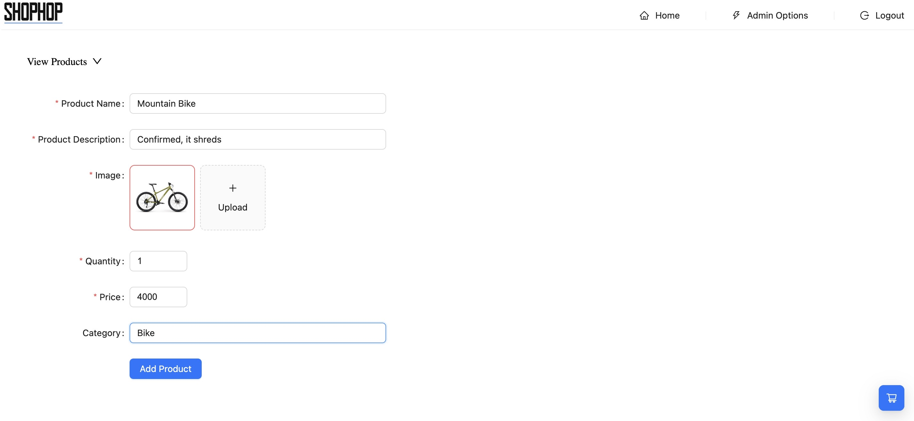
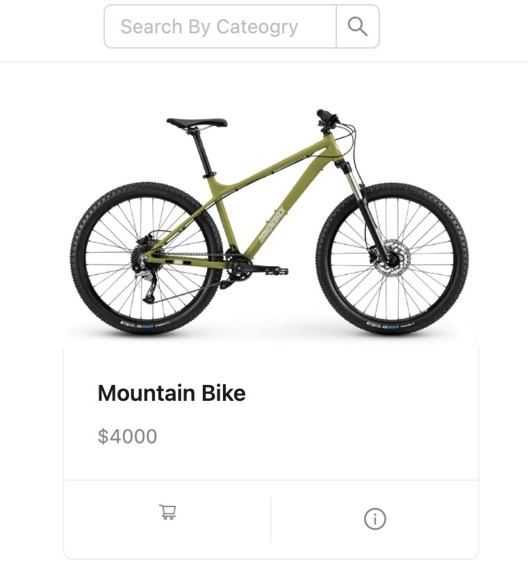
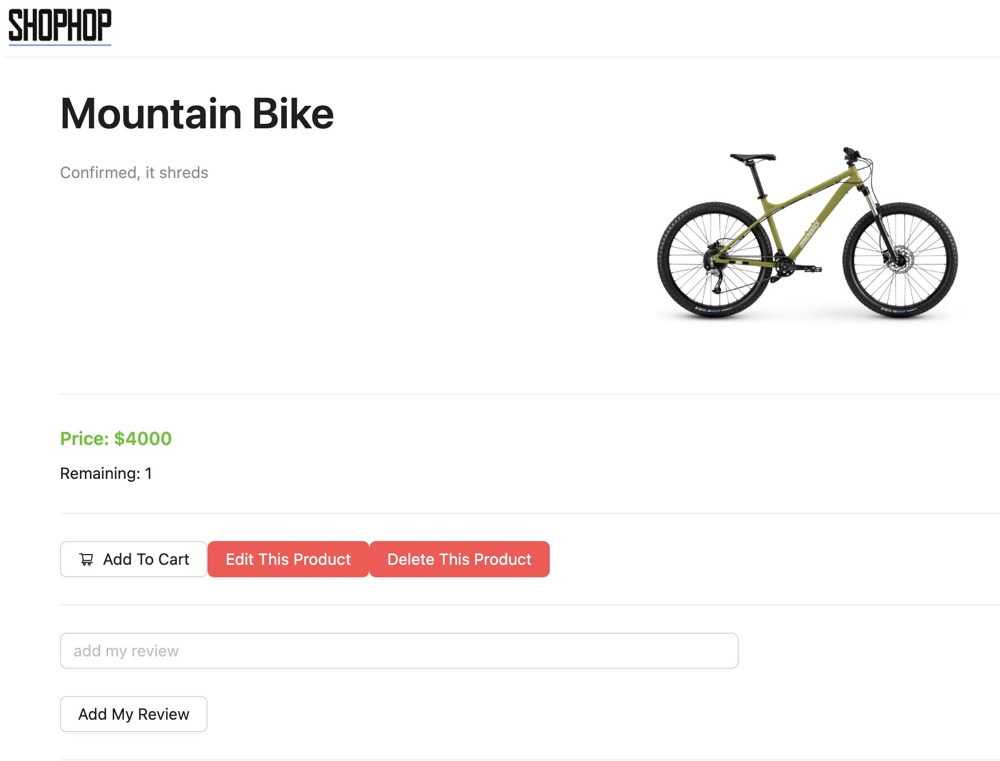

# ShopHop Online Commerce

## Description

ShopHop is an online commerce platform where administrators can build an online commerce platform where users can register and shop for products.


  ## Table of Contents
1. [Usage](#usage)
2. [User Story](#userstory)
3. [Contributing](#contributing)
4. [Questions](#questions)

## Usage

After purchasing this product, the admin user can access the store building features of this application, uploading products, quantities, prices, and pictures. They can then edit or delete them as needed. The users can create an account, add things to their cart, and purchase them.

Add product page:



Home page:



Detail page (admin view):



## User Story

```md
AS a business owner who wants to sell my products
I WANT a modular platform through which i can manage my products
SO THAT clients can have a user friendly experience when shopping on my website
```

```md
GIVEN a commerce platform
WHEN the adminstrator logs in
THEN they find product management tools including managing products, photos, stock, descriptions, categories
WHEN the user lands on the website
THEN they are presented with products that the business owner has uploaded
WHEN the user clicks on a product
THEN they are brought to a page that shows a photo of the product, price, description, rating?
WHEN the user clicks on 'add to cart' and isn't logged in
THEN the user is directed to a login/sign up page
WHEN the user clicks on 'add to cart' and is logged in
THEN the product is added to the cart
WHEN the user leaves a review
THEN the user's review is added to the product page
WHEN the user selects 'view my cart'
THEN they are redirected to the stripe platform to complete the purchase
```
## Contributing

<a href="https://github.com/harryhamlin">github.com/harryhamlin</a>
<a href="https://github.com/Andrew-Techmaster">github.com/Andrew-Techmaster</a>
<a href="https://github.com/DuretiTilmo">github.com/DuretiTilmo</a>
<a href="https://github.com/andyabebaw">github.com/andyabebaw</a>

## Questions

For any questions, please reach out directly to <a href="mailto:harryhamlin@gmail.com" target="_blank">harryhamlin@gmail.com</a>.

